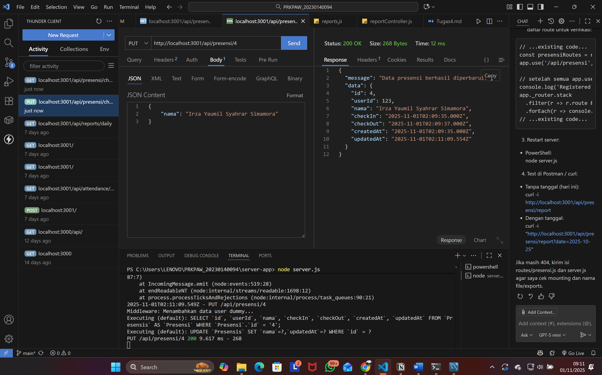
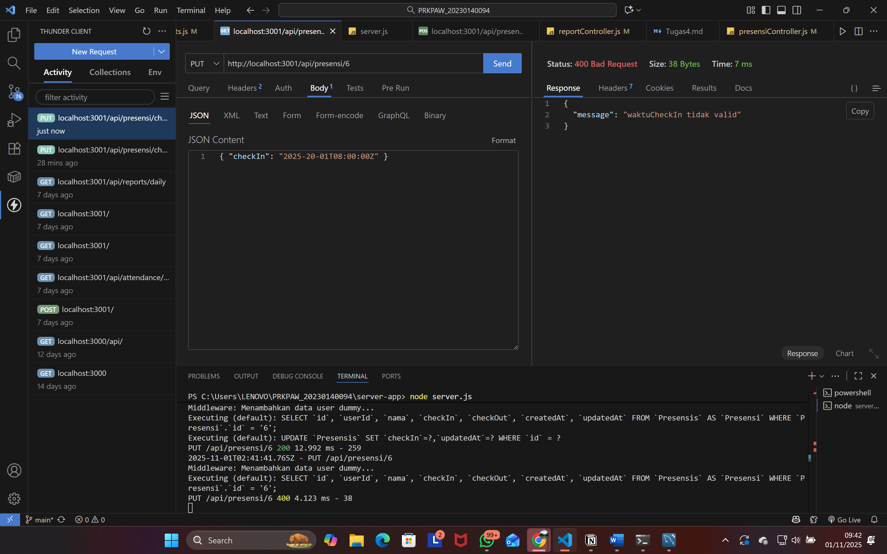
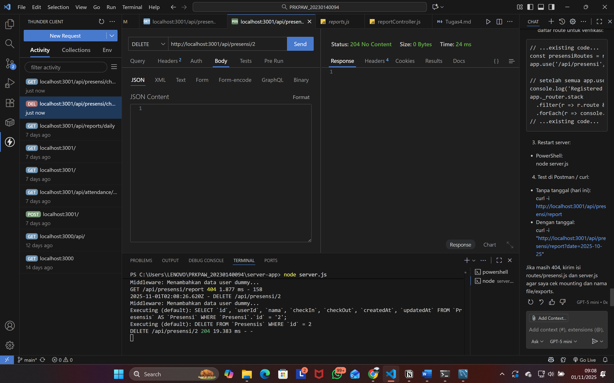
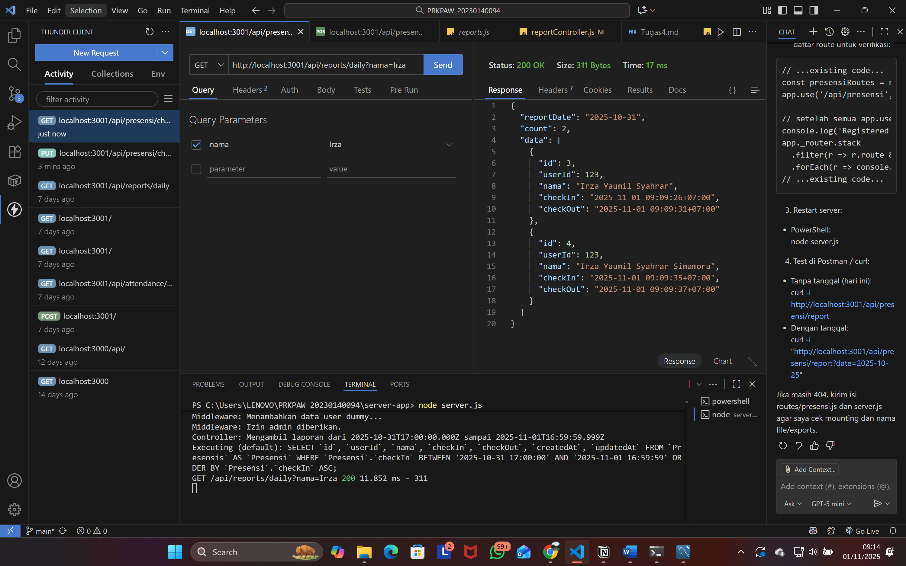
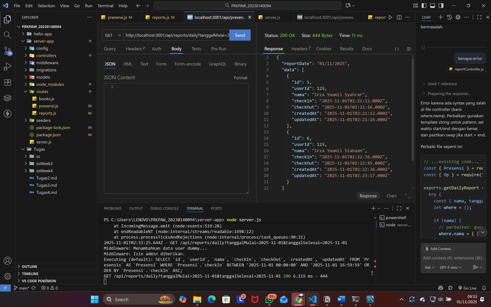

# Tugas 5

## Dokumentasi Endpoints (screenshots)

1.Endpoint update data presensi

2.Endpoint update — format tanggal tidak valid

3.Endpoint delete data

4.Endpoint search berdasarkan nama

5.Endpoint search berdasarkan tanggal
